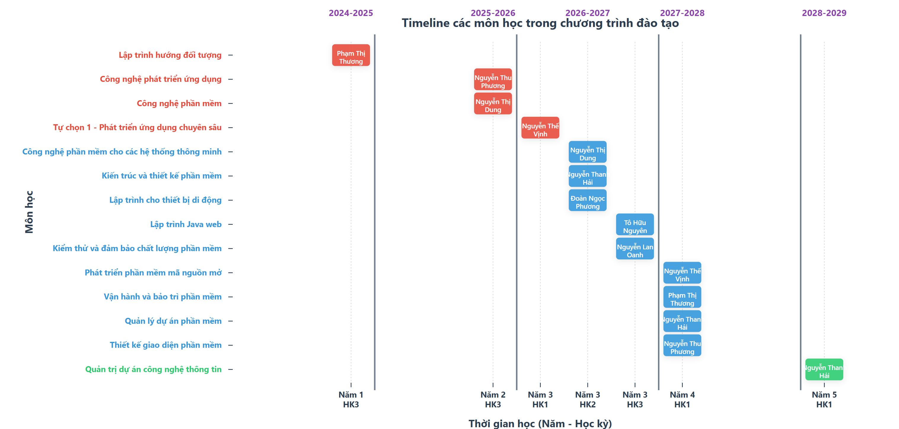

# 💻 Ngành Kỹ thuật phần mềm

## 🏛️ Bộ môn Công nghệ Phần mềm

Bộ môn Công nghệ Phần mềm, trực thuộc Khoa Công nghệ Thông tin được thành lập từ năm 2001. Bộ môn chịu trách nhiệm đảm nhận giảng dạy các học phần về lĩnh vực Kỹ thuật phần mềm, thuộc 3 khối kiến thức chính:

- **🔄 Cơ sở ngành (42 tín chỉ)**: Lập trình hướng đối tượng, Công nghệ phát triển ứng dụng, Công nghệ phần mềm, Phát triển ứng dụng chuyên sâu
- **⚡ Kiến thức ngành (36 tín chỉ)**: Công nghệ phần mềm cho hệ thống thông minh, Kiến trúc và thiết kế phần mềm, Lập trình cho thiết bị di động, Lập trình Java web, Kiểm thử và đảm bảo chất lượng phần mềm, Phát triển phần mềm mã nguồn mở, Vận hành và bảo trì phần mềm, Quản lý dự án phần mềm, Thiết kế giao diện phần mềm
- **🧪 Chuyên sâu bằng Kỹ sư (30 tín chỉ)**: Quản trị dự án công nghệ thông tin và các môn học chuyên sâu khác

Bên cạnh đó, Bộ môn chịu trách nhiệm hướng dẫn thực tập và đồ án tốt nghiệp cho các sinh viên đăng ký theo học ngành Kỹ thuật phần mềm.
## Năm học 2025 - 2026
[📋 Khối lượng giảng dạy](https://ictu-se.github.io/KTPM/2025_2026.html)

## 📊 Xem chương trình đào tạo chi tiết

*👆 Click vào ảnh để mở timeline tương tác và xem thông tin chi tiết các môn học*

## 🔗 Link công việc

[📋 Thực tập cơ sở hệ kỹ sư K20](https://ictu-software-engineering.github.io/KTPM/TTKS_K20.html)

## 👨‍💼 Lãnh đạo Bộ môn

### 🎯 Trưởng bộ môn
- **👤 Họ tên**: TS. Nguyễn Thế Vịnh
- **💼 Chức vụ**: Trưởng bộ môn
- **🔬 Lĩnh vực nghiên cứu**: Trí tuệ nhân tạo, Lập trình hướng đối tượng, .NET…
- **📞 Điện thoại liên hệ**: 0944.550.550
- **✉️ Email**: vinhnt@ictu.edu.vn
- **🏢 Văn phòng làm việc**: Phòng 416 tầng 4 nhà C1

### 🤝 Phó Trưởng bộ môn
- **👤 Họ tên**: TS. Tô Hữu Nguyên
- **💼 Chức vụ**: Phó Trưởng bộ môn
- **🔬 Lĩnh vực nghiên cứu**: Phát triển phần mềm; Quản lý dự án, Kiểm thử, Phân tích thiết kế…
- **📞 Điện thoại liên hệ**: 0989.146.142
- **✉️ Email**: thnguyen@ictu.edu.vn
- **🏢 Văn phòng làm việc**: Phòng 416 tầng 4 nhà C1

## 👥 Đội ngũ cán bộ giảng viên trong bộ môn

| STT | 👤 Họ và tên | 💼 Chức vụ | 📋 Nhiệm vụ | 📞 Số điện thoại | ✉️ Email liên hệ |
|-----|-----------|---------|----------|---------------|---------------|
| 1 | TS.Nguyễn Thế Vịnh | Trưởng Bộ môn | Quản lý các hoạt động về xây dựng ngành KTPM | 0944.550.550 | vinhnt@ictu.edu.vn |
| 2 | TS. Tô Hữu Nguyên | Phó Trưởng Bộ môn | Quản lý các hoạt động chuyên môn ngành KTPM | 0989.146.142 | thnguyen@ictu.edu.vn |
| 3 | TS. Nguyễn Văn Tảo | Giảng viên chính | Giảng dạy | 0913.286.685 | nvtao@ictu.edu.vn |
| 4 | TS. Quách Xuân Trưởng | Giảng viên chính | Giảng dạy | 0989.090.832 | qxtruong@ictu.edu.vn |
| 5 | TS. Nguyễn Văn Núi | Giảng viên chính | Giảng dạy | 0964.719.929 | nvnui@ictu.edu.vn |
| 6 | TS. Bùi Anh Tú | Giảng viên | Giảng dạy | 0914.400.246 | batu@ictu.edu.vn |
| 7 | TS. Nguyễn Thanh Hải | Giảng viên | Giảng dạy | 0968.550.888 | nthai@ictu.edu.vn |
| 8 | TS. Vũ Đức Quang | Giảng viên | Giảng dạy | 0352.340.851 | vdquang@ictu.edu.vn |
| 9 | ThS. Phạm Thị Thương | Giảng viên chính | Giảng dạy | 0912.838.646 | ptthuong@ictu.edu.vn |
| 10 | ThS. Nguyễn Hồng Tân | Giảng viên chính – NCS | Giảng dạy | 0943.252.165 | nhtan@ictu.edu.vn |
| 11 | ThS. Đào Thị Thu | Giảng viên chính – NCS | Giảng dạy | 0912.342.000 | dtthu@ictu.edu.vn |
| 12 | ThS. Nguyễn Lan Oanh | Giảng viên | Giảng dạy | 0948.135.145 | nloanh@ictu.edu.vn |
| 13 | ThS. Nguyễn Thu Phương | Giảng viên | Giảng dạy | 0982.483.420 | ntphuong@ictu.edu.vn |
| 14 | ThS. Nguyễn Thị Dung | Giảng viên | Giảng dạy | 0974.322.455 | ntdung@ictu.edu.vn |
| 15 | ThS. Trần Hải Thanh | Giảng viên | Giảng dạy | 0946.600.515 | ththanh@ictu.edu.vn |
| 16 | ThS. Đoàn Ngọc Phương | Giảng viên | Giảng dạy | 0979.479.940 | dnphuong@ictu.edu.vn |
| 17 | ThS. Hoàng Thị Cành | Giảng viên – NCS | Giảng dạy | 0382.324.556 | htcanh@ictu.edu.vn |
| 18 | ThS. Nguyễn Văn Việt | Giảng viên – NCS | Giảng dạy | 0912.660.246 | nvviet@ictu.edu.vn |

| 19 | ThS. Võ Văn Trường | Giảng viên – NCS | Giảng dạy | 0973.563.273 | vvtruong@ictu.edu.vn |
